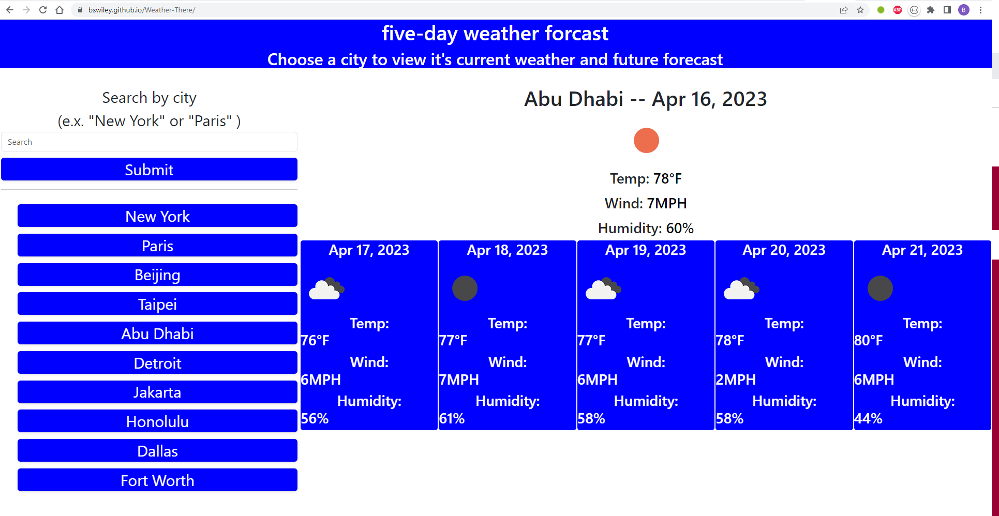

# Repository Title

## Description

## Installation
I have already deployed this to the website https://bswiley.github.io// so nothing further needs to be done to get it to work.  A copy of the index is at the same level in the repository as is this README.md file.  Also in the same directory is the following screencapture:   

## License
I have chosen the MIT license to allow the free use of the software while also asserting it being used "as is." 